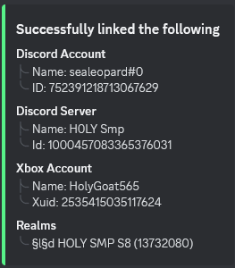

 
# Realm Bot Setup
description: This will explain in detail how to setup realm bot in your guild 

## STEP ONE 
 First you have to authorise the minecraft account that owns the realm to realm bot 
 You can do so [here](https://realmbot.dev/account)
 `If the wrong account is getting connected to realm bot go to https://www.xbox.com/live and login with the corret account there`
 
## STEP TWO 
  After you have authorised your account to realm bot the next step is to connect that account to realm bot in your server 
  to connect your account to your guild run `/connect` command in your guild 
  

## STEP THREE
  After you have succcessfully linked your realm to your guild you can configure the bot like command permissions, ban logs, etc at our [dashboard](https://realmbot.dev)
  To know more on how to setup via the dashboard check `dashboard` for info 
